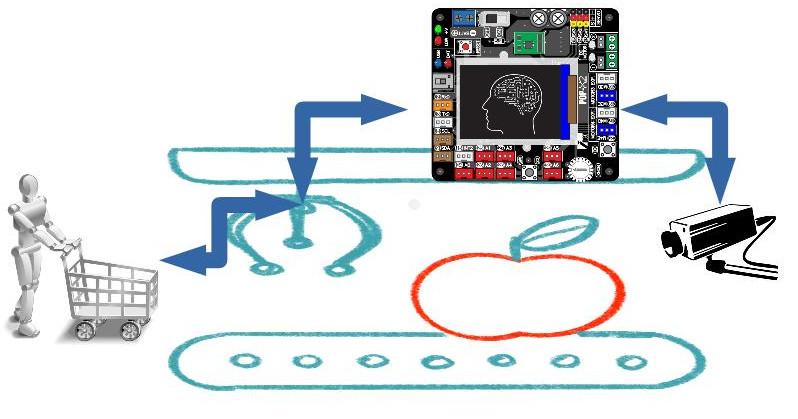
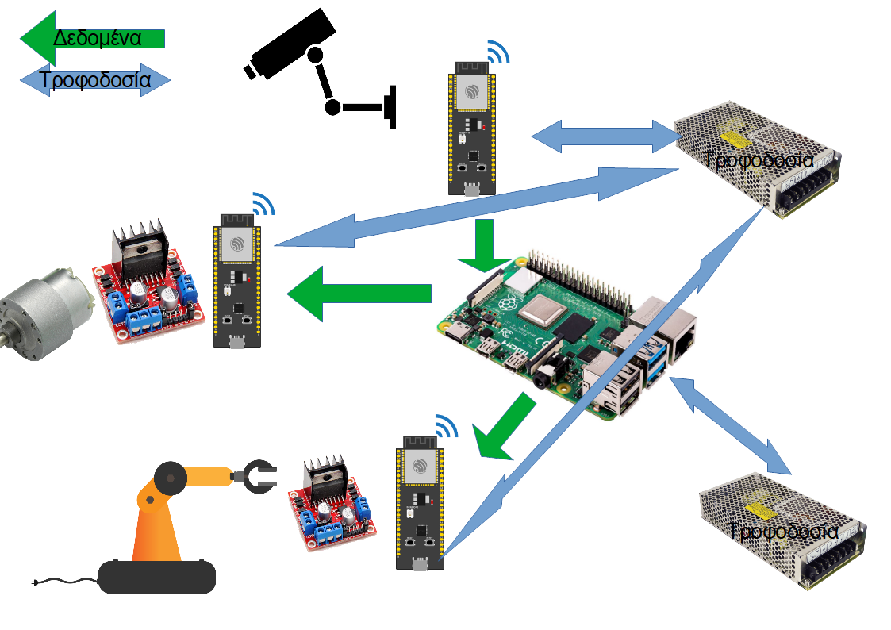

#  Μοντέλο γραμμής παραγωγής
Το συγκεκριμένο έργο είναι μία προσπάθεια προσομοίωσης μιας γραμμής παραγωγής ενός εργοστασίου

**Ομάδα:  "Βιομηχανική Γραμμή"** (Μαθητές της Β' Ηλεκτρολογίας και της Γ πληροφορικής του  **ΕΠΑΛ Θήβας** )

**Σχολείο:** ΕΠΑΛ Θήβας.

**Τίτλος έργου:** «Χρήση της τεχνητής νοημοσύνης σε βιομηχανικές γραμμές παραγωγής »

______
# Σχεδιάγραμμα της ιδέας 

___

Όπως φαίνεται και στο παραπάνω διάγραμμα θα γίνει μία προσπάθεια υλοποίησης βιομηχανικής γραμμής παραγωγής η οποία με τη χρήση της τεχνητής νοημοσύνης θα μπορεί να κάνει διαλογή στα αντικείμενα που κινούνται πάνω στο ραουλόδρο σύμφωνα με την εκπαίδευση μηχανής (machine learning) που θα έχουμε υποβάλει τη μηχανή.
______

#  Αναλυτική περιγραφή του έργου

___
Υλοποίηση του έργου θα περιέχει την κατασκευή από 3d printer βασικού ραουλόδρομου της γραμμής παραγωγής. Στον οποίο θα έχουν εγκαταστάθει ο βασικός controller όσο και οι απαιτούμενη αισθητήρες για την αυτοματοποιημένη λειτουργία του ραουλόδρομου. Η κίνηση του ραουλόδρομου θα ελέγχετε από τους αισθητήρες, η διαλογή των αντικειμένων θα γίνεται μέσω κάμερας που θα είναι συνδεδεμένος ο κεντρικός controller, το τέλος του ραουλόδρομου θα καταλήγει σε σύστημα διαλογής σύμφωνα με τα αποτελέσματα που θα έχουν παραχθεί από την κεντρική επεξεργαστική μονάδα.

Η κεντρική επεξεργαστική μονάδα θα αποτελείται από ένα raspberry pi που θα έχει την δυνατότητα απομακρυσμένου ελέγχου σε μονάδες ελέγχου τόσο της κίνησης του ραουλόδρομου όσο και συλλογής εικόνων για την επεξεργασία και την διαλογή του τελικού σημείου του ραουλόδρου μου.

______

#  Στόχοι 

___
Οι στόχοι του συγκεκριμένου project είναι πολλοί και σημαντικοί. Η ομάδα θα έχει την δυνατότητα να εξοικειωθεί, να πειραματιστεί και να υλοποιήσει μεμονωμένα κομμάτια ή και το σύνολο των ακόλουθων δεξιοτήτων

* Σχεδιασμού και κατασκευή με 3d printer
* Κατανόηση των αρχών σχεδιασμού μιας βιομηχανικής γραμμής
* Εμπειρία με χρήση διαφόρων αισθητήρων
* Εμπειρία στην διασύνδεση κεντρικού και κατανεμημένου μικρό επεξεργαστή
* Αντιμετώπιση προβλημάτων προγραμματισμού και υλοποίησης καθόλη την περίοδο υλοποίησης
* Γνωριμία με τα προγράμματα για τον προγραμματισμό των μικροελεκτών
* Γνωριμία και εμπειρία με προγράμματα ανοιχτού κώδικα
* Δημιουργία μοντέλο βιομηχανικής γραμμής με στόχο την επίδειξη και την δυνατότητες που έχουν οι σημερινές σύγχρονες βιομηχανικές γραμμές
* Δυνατότητα συνδυασμού σε ένα αυτοματισμό τόσο τον απλών αισθητήρων όσο και σύγχρονων καμερών
* Γνωριμία ε τις σύγχρονες τάσεις αυτοματισμών χαμηλού budget

______

#  Λίστα υλικών

___
Παρακάτω δίνεται όλη η λίστα των βασικών εξαρτημάτων του κυκλώματος : 

| A/A | υλικό                      | τεμ | τιμή μονάδας |
|-----|----------------------------|-----|--------------|
| 1   | Raspberry Pi               | 1   | 96,9         |
| 2   | Camera                     | 1   | 42,8         |
| 3   | power supply               | 1   | 14,8         |
| 4   | Arduino Uno                | 1   | 29,9         |
| 5   | Motor shield               | 1   | 29,9         |
| 6   | power supply               | 1   | 12,4         |
| 7   | NodeMCU ESP8266            | 2   | 6,8          |
| 8   | Motor shield               | 1   | 12,5         |
| 9   | power supply               | 1   | 12,4         |
| 10  | DC Motor                   | 1   | 3,2          |
| 11  | RC Servo 9g                | 5   | 11,8         |
| 12  | IR sensor                  | 3   | 2,5          |
| 13  | LEDs for lighting          | 1   | 6,9          |
| 14  | Ball Transfer Unit Bearing | 4   | 1,4          |
| 15  | διάφορα μικρό υλικά        | 1   | 30           |

Η παραπάνω τιμές είναι ενδεικτικές κι οι τρέχουσες στη συγκεκριμένη περίοδο.

Το συνολικό κόστος του project είναι περίπου στο 370 ευρώ

