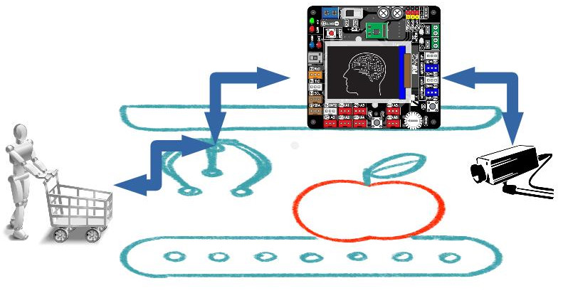

#  Μοντέλο γραμμής παραγωγής
Το συγκεκριμένο έργο είναι μία προσπάθεια προσομοίωσης μιας γραμμής παραγωγής ενός εργοστασίου

**Ομάδα:  "Βιομηχανική Γραμμή"** (Μαθητές της Β' Ηλεκτρολογίας και της Γ πληροφορικής του  **ΕΠΑΛ Θήβας** )

**Σχολείο:** ΕΠΑΛ Θήβας.

**Τίτλος έργου:** «Χρήση της τεχνητής νοημοσύνης σε βιομηχανικές γραμμές παραγωγής »

______
# Περιγραφικό Διάγραμμα του Συστήματος

___

______

